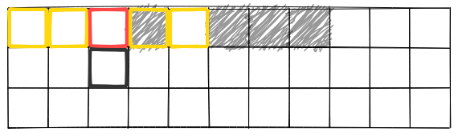
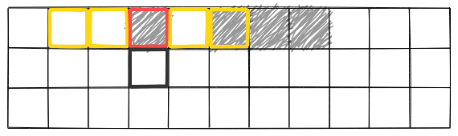
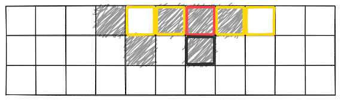
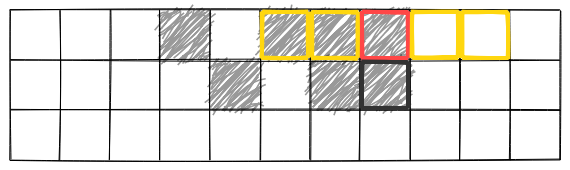
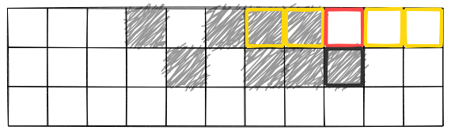

# Wundernut X Öredev

*November 2018*

(Find our other wundernuts [here](https://github.com/wunderdogsw/wunderpahkinas))

Back in the days our grandparents kept themselves entertained at school with this game and now we’ve transformed it into a Wundernut!
So, take out a grid paper and start filling it in according to the rules.

The first line is always given. Some squares are filled, others are blank. You will start filling in the second line and lines after that. 

The filling of each square is defined by the square above it and 4 squares next to it (2 squares on each sides).

- Rule #1, the square above is blank: If there are 2 or 3 filled squares in total next to it (taking into account 4 squares, 2 on each sides) it will be filled. If not, it will be left blank.
- Rule #2, the square above is filled: If there are 2 or 4 squares filled in total next to it (taking into account 4 squares, 2 on each sides) it will be filled. If not, it will be left blank.

In case the square you are examining is at the beginning or at the end of a row, i.e. the first, second, penultimate or last, you take into account only the squares there are next to the middle square,
which could be 0, 1 or 2 squares on either side.

### EXAMPLES:

You’re thinking whether to fill or leave blank the square marked with black. You need to examine the square above (red) and
4 squares around it, 2 on each sides (yellow). Because the square above (red) is blank, rule #1 applies. There is only 1 square filled within the 4 surrounding squares, so you'll leave the square blank.

Here, the square above (red) is filled, so rule #2 applies. Only 1 square filled next to it (yellow squares), so the black square is left blank.

The square above is blank, rule #1 applies. There are 3 squares filled (yellow squares), so the black square is filled.

The square above is filled, rule #2 applies. There are 3 squares filled (yellow), the black square is left blank.

The square above is filled, rule #2 applies. The black square is filled.

The square above is filled, rule #2 applies. The black square is filled.

The square above is blank, rule #1 applies. The black square is filled.

### THE TASK:

Examine the patterns given by continuing it according to the rules. Define whether the pattern is "gliding", “blinking", “vanishing" or "other".
Below the definitions of these types of patterns. Fill in the lines until you recognise a pattern type.
The maximum line number needed to examine is 100 (including the first given line). Note that pattern width isn’t limited to
the width given in the input file; you can assume an infinite number of empty squares exist preceding and succeeding the pattern.

Definitions:

1) **blinking**: The pattern and location of colored squares is exactly the same as in some of the preceding lines. E.g.

2) **gliding**: The pattern of colored squares is the same as in some of the preceding lines, but is located in different position. E.g.

3) **vanishing**: There are no colored squares on a line. E.g.

4) **other**: None of the preceding types is detected when the last line was reached.

**Input**: Patterns defined in file [patterns.txt](./patterns.txt), where **#** stands for colored square and **.** for empty square.

**Output**: Detected pattern type for each input line. For example, if input contained 4 patterns, output could be:

    gliding
    vanishing
    other
    blinking

### GENERAL RULES:

- You can use any programming language to solve the problem.
- The solution must contain the right answer.
- The winner will be the most elegant solution, decided by the Wundernut jury.
- Performance is a part of elegance.
- The participant gives Wunderdog the right to publish their source code used in the submitted solutions.
- Send your solution to pahkina@wunderdog.fi by 20th of November.
- We'll announce the winner at Öredev on Wednesday 21st of November.

The winner is chosen by our Wunderdog jury and he/she will be awarded with Bohemian Rhapsody movie tickets.
